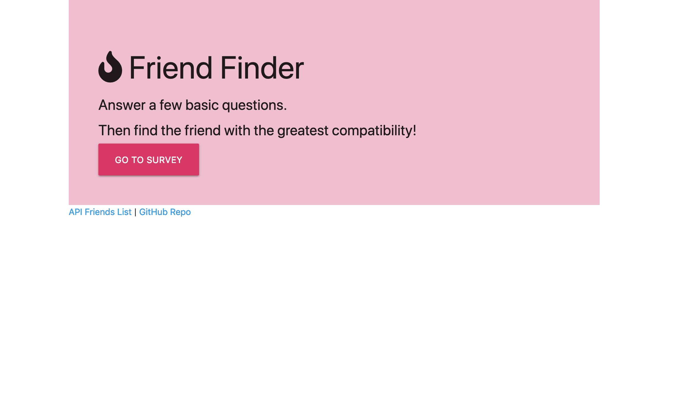
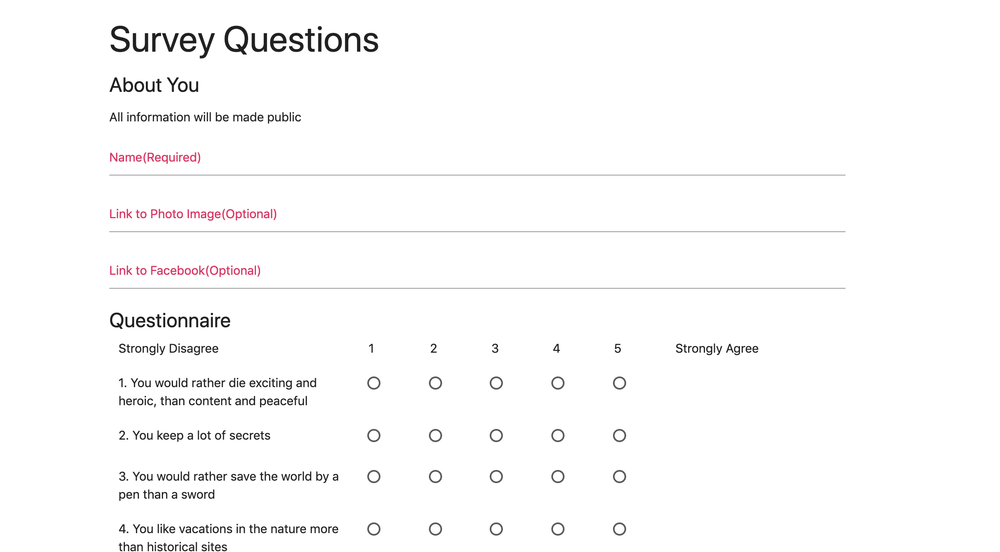
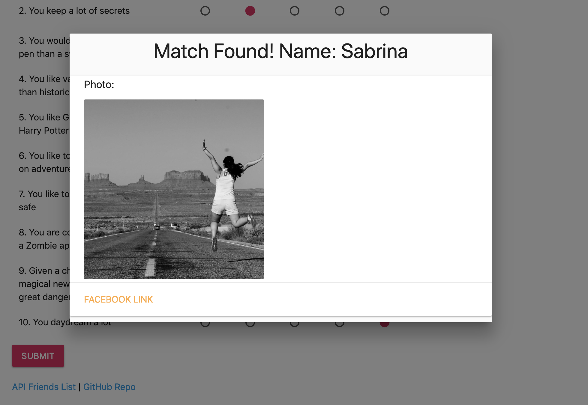

# Friend Finder - Node and Express Servers

### Overview

This is a compatibility-based "FriendFinder" application -- basically a dating app. This full-stack site takes in results from users' surveys, then compare their answers with those from other users. The app will then display the name and picture of the user with the best overall match.

Tech Stack:

HTML/CSS/Materilaize

Node/Express routing 

JSON files as data storage

App deployed via Heroku [here](https://sabrinal-friendfinder.herokuapp.com)

----
### How to use

-  When entering the website survey, you will give your basic information

- Then you will be asked 10 questions, each on a scale of 1 to 5 based on how much the you agree or disagree with the statement.

- All your answers are saved on the server as a json file(array of objects). All information entered are made public, you can choose not to enter pictures or facebook links

- The website then calculate your compatibility with all other users from the website(smart right?) Then present you with the most compatible user via modal pop-up.

- Enjoy your new friend!

